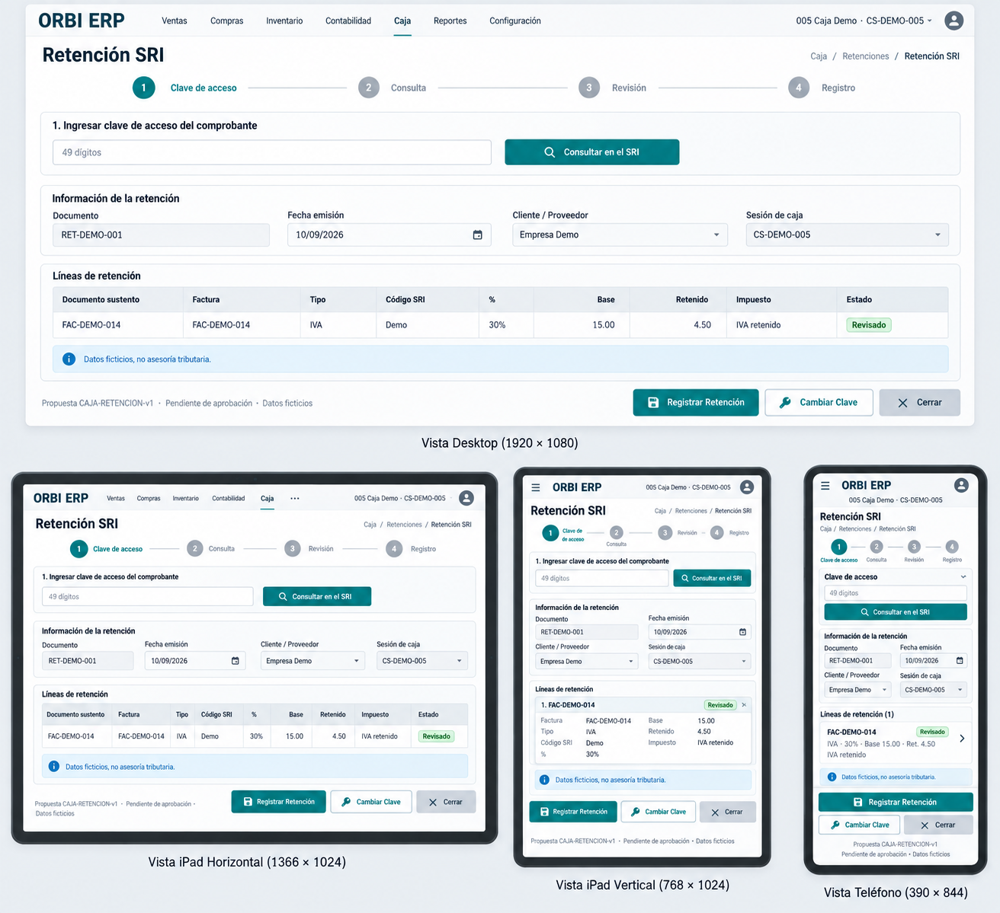
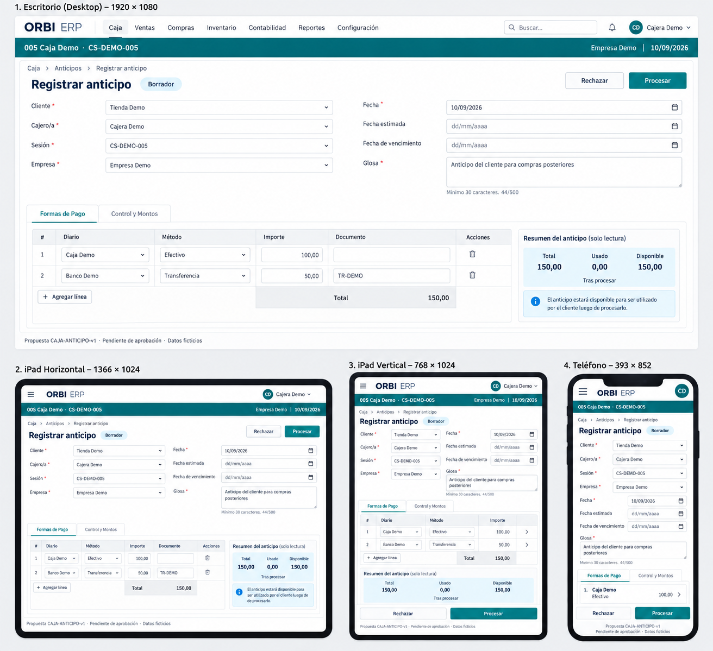
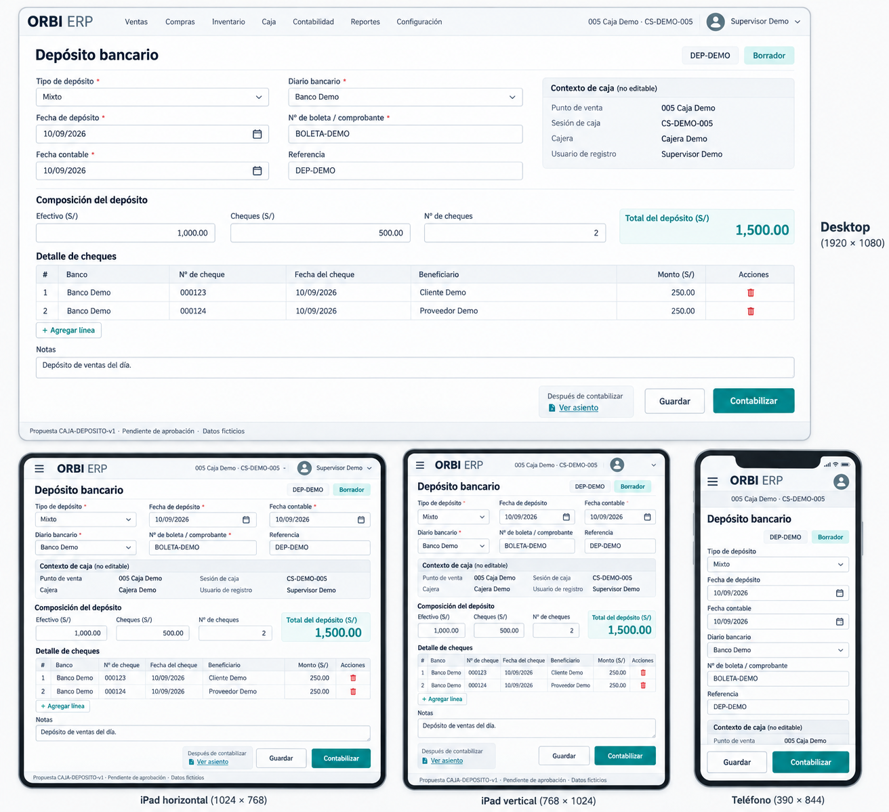
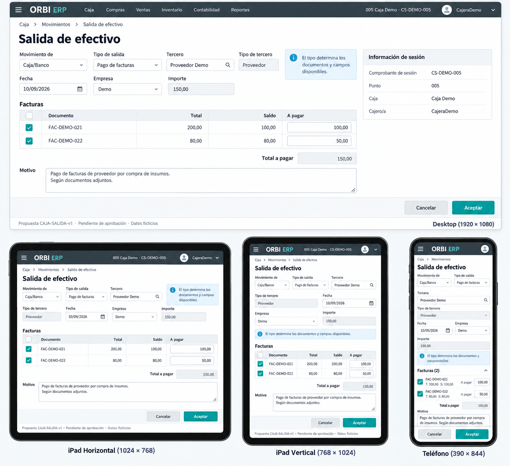
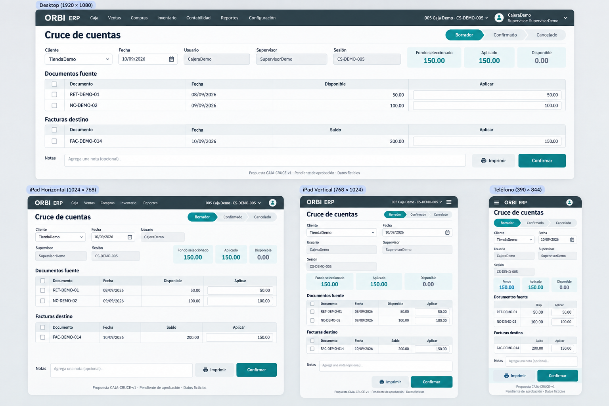
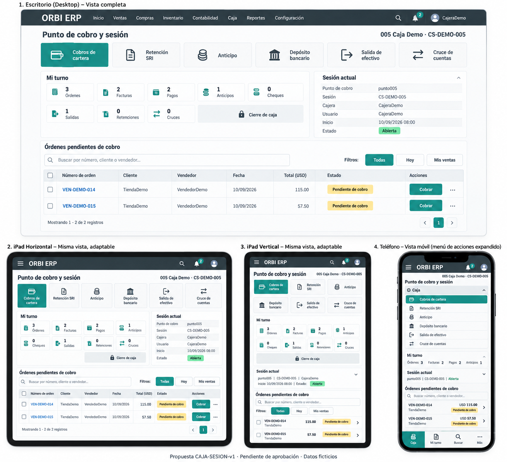

# Formularios de Caja — revisión visual

Fecha: 2026-09-10. Son propuestas estáticas, no capturas de una app implementada.
Cada lámina contiene desktop, iPad horizontal, iPad vertical y teléfono.

## Fuentes revisadas

Código local en `/Users/elmers/Documents/dev_odoo20/addons/`:

- `l10n_ec_collection_panel/models/collection_panel.py`: `_PANEL_ACCIONES_CAJA`, `panel_accion_caja`, `_PANEL_TURNO_BOTONES`.
- `l10n_ec_collection_box/models/collection_session.py`: acciones que abren los formularios y contexto de sesión.
- `l10n_ec_collection_box/wizards/collection_withhold_sri_import_views.xml`.
- `l10n_ec_advances/views/account_advance_views.xml` y herencia de collection_box.
- `l10n_ec_collection_box/views/collection_session_deposit_views.xml`.
- `l10n_ec_collection_box/views/cash_out_form_collection.xml`.
- `l10n_ec_account_base/views/cross_allocation_views.xml` y herencia `withhold_cross_views.xml` de collection_box.

## Correcciones pendientes detectadas en las imágenes

Estas láminas NO son un contrato exacto de campos/permisos y no se implementarán tal cual:

- Retención: la imagen combina captura y resultado. Separar estados draft/loaded; el cliente y datos descargados no se editan libremente. No convertir las cuatro etiquetas visuales en cuatro estados backend. Quitar selector Cliente/Proveedor inventado para esta importación.
- Anticipo: la sesión no es libremente editable para el cajero; respetar condiciones de la herencia. El contador 44/500 y obligatoriedad dibujada no demuestran restricciones del modelo. Desplegar campos reales de tarjetas/cheques al mostrar esos casos.
- Depósito: reemplazar moneda S/ por la moneda de Odoo, en esta muestra USD. La rejilla de cheques agregada por el generador no está acreditada por la vista revisada: no implementar ni aprobar como paridad. Usar número e importe de cheques existentes. Corregir Punto de venta a Punto de cobro. La edición de sesión depende de permisos, no de una prohibición universal.
- Salida: respetar campos ocultos cash_flow/journal_id; no introducir un nuevo selector Movimiento de Caja/Banco. El tipo determina las variantes de documentos.
- Cruce: campo Notas y casillas añadidos visualmente no están acreditados por la vista; no implementar como reglas nuevas. Estado y saldo disponible son del backend.
- Sesión: falta Nueva Orden y completar acceso a todos los contadores en móvil. Esta lámina no representa apertura/arqueo/cierre completos.

Los datos son ficticios. El diseño no sustituye la revisión de herencias, permisos y comportamiento runtime antes de implementar.

## CAJA-RETENCION-v1 — Retención SRI

Estado: PROPUESTA, pendiente de aprobación y correcciones de fidelidad.

Brief de generación (herramienta integrada imagegen):

Form state Loaded. Workflow strip Clave de acceso → Consulta → Revisión → Registro. A small first-step inset with blank access-key field '49 dígitos' and Consultar en el SRI. Main loaded form document RET-DEMO-001, date10/09/2026, customer Empresa Demo, session CS-DEMO-005. Read-only grid columns Documento sustento, Factura, Tipo, Código SRI, %, Base, Retenido, Impuesto, Estado. One illustrative row FAC-DEMO-014, FAC-DEMO-014, IVA, Demo, 30%, 15.00, 4.50, IVA retenido, Revisado. Caption Datos ficticios, no asesoría tributaria. Footer Registrar Retención, Cambiar Clave, Cerrar. Do not generate fake 49digit key. Invoice selector only for unresolved invoice lines. Record only after review.

## CAJA-ANTICIPO-v1 — Registrar anticipo

Estado: PROPUESTA, pendiente de aprobación y correcciones de fidelidad.

Brief de generación (herramienta integrada imagegen):

Draft account.advance form. Customer Tienda Demo, cashier Cajera Demo, session CS-DEMO-005, company Empresa Demo, date10/09/2026, estimated date and due date optional shown. Glosa 'Anticipo del cliente para compras posteriores', helper mínimo30 caracteres. Tabs Formas de Pago and Control y Montos. Editable payment grid Journal, Método, Importe, Documento. Cash row Caja Demo Efectivo100 and bank row Banco Demo Transferencia50 refTR-DEMO. Total150. Controls for card or check additional details through row expand if applicable, no creating journals/payment methods. Procesar main, Rechazar secondary. State Borrador. Small read-only tab preview total150 usado0 disponible150 caption 'Tras procesar'. Do not show print until processed.

## CAJA-DEPOSITO-v1 — Depósito bancario

Estado: PROPUESTA, pendiente de aprobación y correcciones de fidelidad.

Brief de generación (herramienta integrada imagegen):

Form reference DEP-DEMO, deposit type Mixto selected with Efectivo Cheques Mixto alternatives, amount1500, date deposit and accounting date10/09/2026. Cash1000, Checks500, number checks2. Bank journal Banco Demo, slip BOLETA-DEMO. SessionCS-DEMO-005, point005 Caja Demo, cashier Cajera Demo, recording user Supervisor Demo separately visible immutable context. Notes. Buttons Guardar and Contabilizar. Link Ver asiento only as secondary inset 'Después de contabilizar'. No assumption cashier current session replacing chosen session.

## CAJA-SALIDA-v1 — Salida de efectivo

Estado: PROPUESTA, pendiente de aprobación y correcciones de fidelidad.

Brief de generación (herramienta integrada imagegen):

Form Movimiento de Caja/Banco from session. Tipo de salida Pago de facturas selected, tercero Proveedor Demo, tipo de tercero Proveedor, Fecha10/09/2026 EmpresaDemo Importe150. Read-only sessionCS-DEMO-005 point005 CajaDemo cashierCajeraDemo. Grid Facturas: FAC-DEMO-021 total200 saldo100 a pagar100, FAC-DEMO-022 total80 saldo80 a pagar50. Total pagar150. Motivo multiline. A small aside 'El tipo determina los documentos y campos disponibles' not invented constraints. Footer Aceptar Cancelar. No bank beneficiary invented. General type would show contrapartida but not selected scenario.

## CAJA-CRUCE-v1 — Cruce de cuentas

Estado: PROPUESTA, pendiente de aprobación y correcciones de fidelidad.

Brief de generación (herramienta integrada imagegen):

Full-width form no tiny modal. Customer TiendaDemo, date10/09/2026, userCajeraDemo supervisorSupervisorDemo sessionCS-DEMO-005. StateBorrador. Upper figures Fondo seleccionado150 Aplicado150 Disponible0. TWO prominent grids stacked: Documentos fuente columns Documento Fecha Disponible Aplicar, rows RET-DEMO-01 balance50 apply50 and NC-DEMO-02 balance100 apply100. Facturas destino grid FAC-DEMO-014 saldo200 aplicar150. Footer Confirmar Imprimir, no cash collection button and no invented charge. State strip Borrador Confirmado Cancelado. Show partial allocation amounts accurately.

## CAJA-SESION-v1 — Punto de cobro y sesión

Estado: PROPUESTA, pendiente de aprobación y correcciones de fidelidad.

Brief de generación (herramienta integrada imagegen):

Workspace Caja with persistent header point005 CajaDemo, sessionCS-DEMO-005 Abierta, cashierCajeraDemo, userCajeraDemo. Visible actions Cobros de cartera Retención SRI Anticipo Depósito bancario Salida de efectivo Cruce de cuentas. Mi turno navigation counters Órdenes3 Facturas2 Pagos2 Anticipos1 Cheques0 Salidas1 Retenciones0 Cruces0 plus Cierre de caja. Small compact detail panel Sesión actual, inicio10/09/2026 08:00 punto005 cajeraDemo estadoAbierta. Main operational pending grid order VEN-DEMO-014 customerTiendaDemo sellerVendedorDemo amount115 statusPendiente de cobro; another order VEN-DEMO-015 amount57.50. Search number/customer/vendor, filters Todas Hoy Mis ventas. Tablet and mobile accessible actions drawer Caja expanded in small screen preserving named actions. This is session context proposal not opening/closing forms and no promise closing validated.
